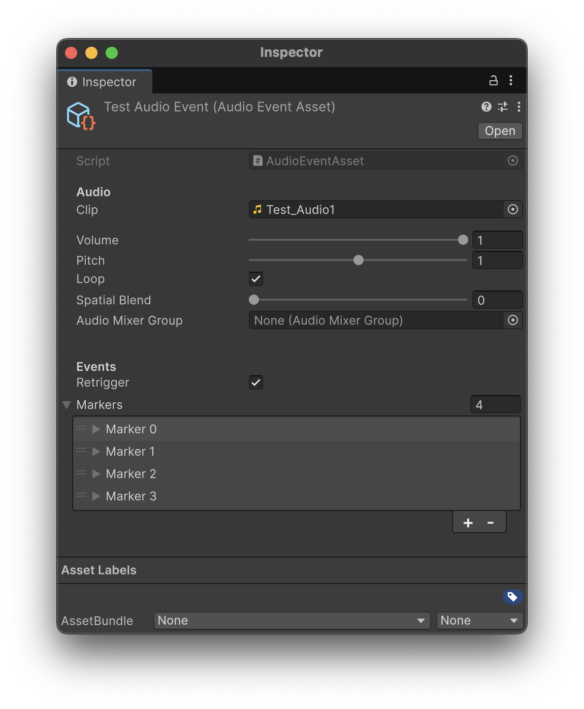
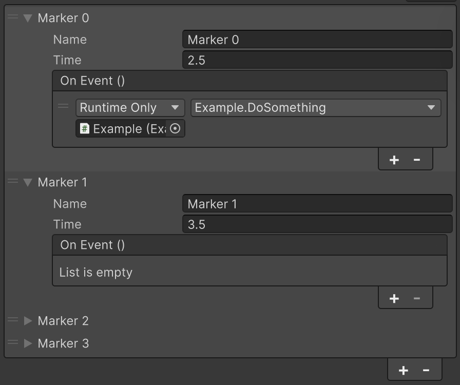
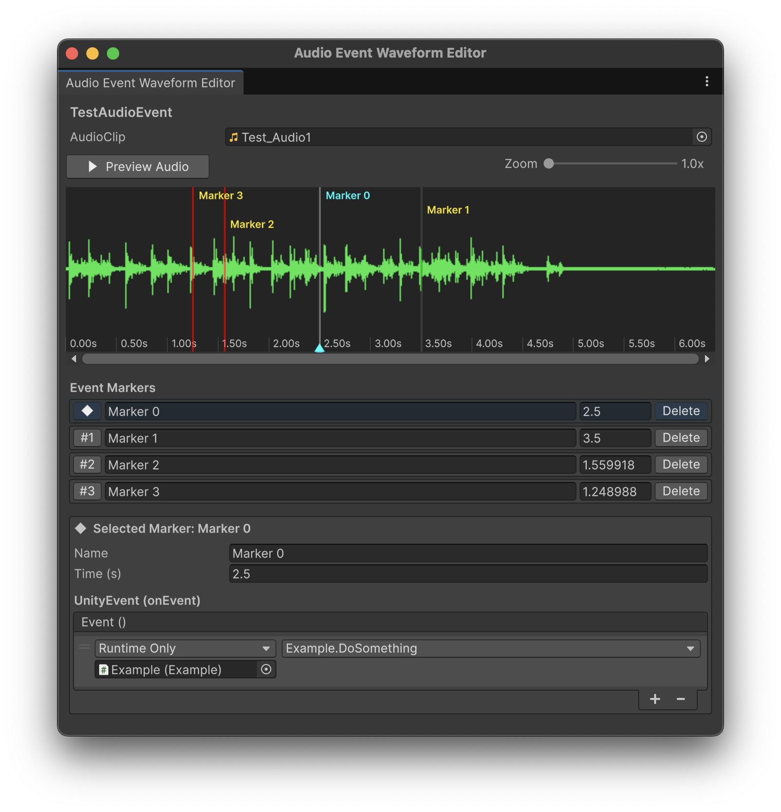
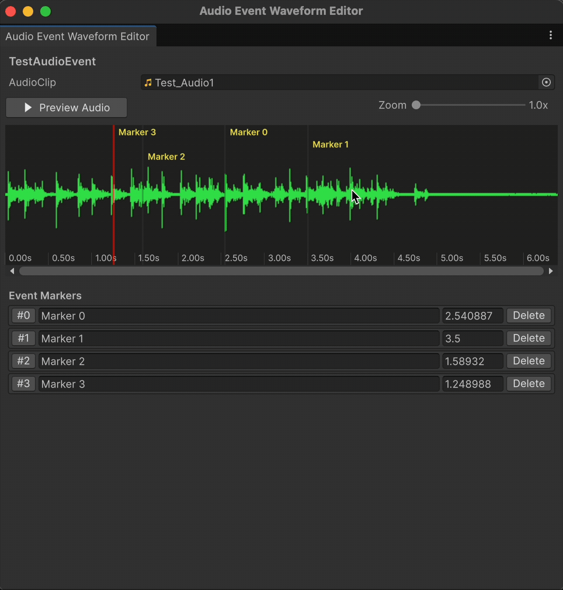
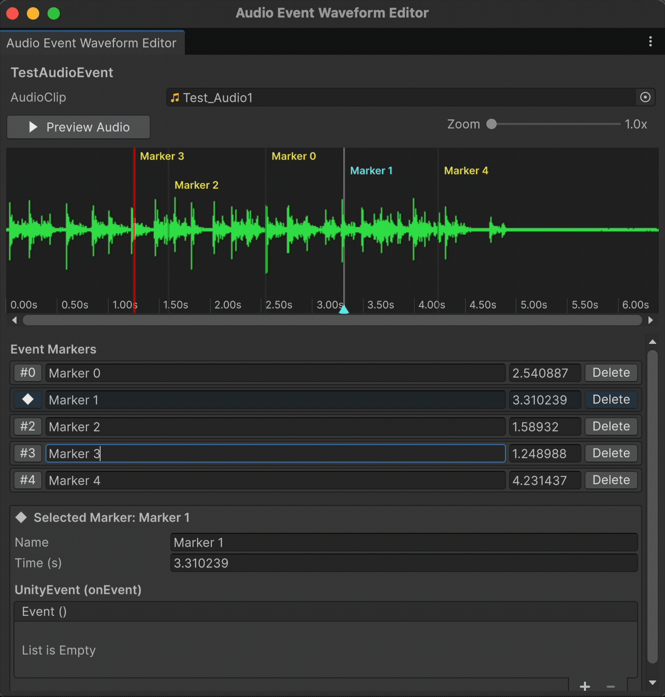
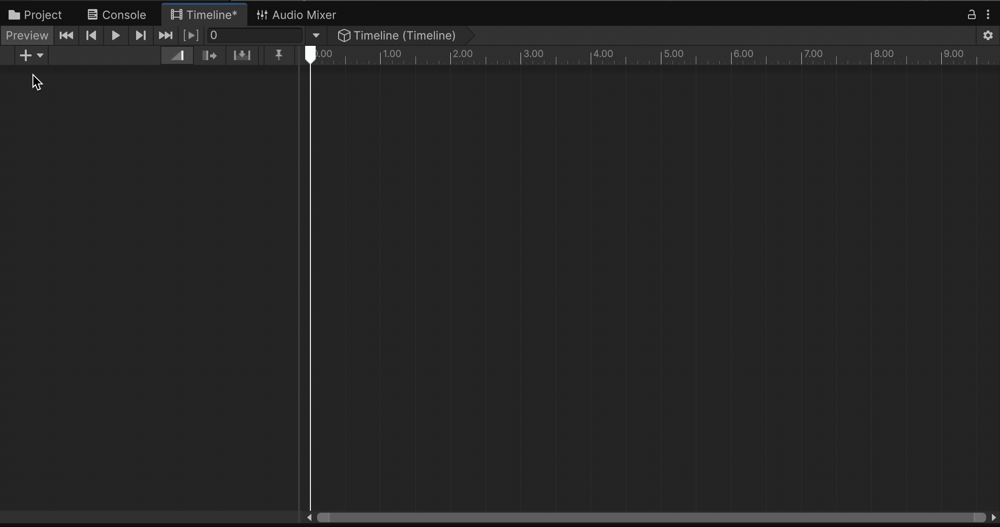

# Unity Audio Callback System

This is an **audio callback system** for Unity that uses the **Unity built-in audio system**. It allows you to invoke callback functions when the audio sources reach certain points in the audio clips. This can be useful for synchronizing events with audio, such as triggering animations, spawning objects, or changing game states.

This system provides similar functionality to the callback systems in `FMOD` and `Wwise`, audio middlewares. It is designed to be easy to use and should be able to be integrated into your existing Unity projects seamlessly.

<br><br>

## Features and Usage

### Overview

The primary unit of this system is the `AudioEventAsset`, a **scriptable object** that holds a reference to an audio clip and a list of callback events. 

Another important component is the `AudioEventPlayer`, a **MonoBehaviour component** that is responsible for playing the audio clip and invoking the callbacks at the appropriate times.

<br>

### AudioEventAsset

To create an `AudioEventAsset`, you can right-click in the Unity Project window, and follow the path: `Create > Scriptable Objects > Audio Event Asset`. An `AudioEventAsset` is the basic unit of this system. 

> To have an audio clip to invoke callbacks, you need to create an `AudioEventAsset` and configure it accordingly.


#### Fields

Each `AudioEventAsset` contains the following fields:

- ***Audio***
  - `Audio Clip`: A reference to the audio clip that will be played.
  - `Volume`: A float value that controls the volume of the audio clip. `Default to 1.0 (full volume)`.
  - `Pitch`: A float value that controls the pitch of the audio clip. `Default to 1.0 (normal pitch)`.
  - `Loop`: A boolean that determines whether the audio clip should loop when played. `Default to false (no looping)`.
  - `Spatial Blend`: A float value that controls the spatial blend of the audio clip (0 for 2D, 1 for 3D). `Default to 0.0 (2D)`.
  - `AudioMixerGroup`: A reference to an `AudioMixerGroup` that the audio clip will be routed through. `Default to null (no routing)`.

<br>

- ***Events***
  - `Retrigger`: A boolean that determines whether the events can be retriggered while it is looping. `Default to false (no retriggering)`.
  - `Markers`: A list of callback events that will be invoked at specific times during the playback of the audio clip.

> Details of the `Marker` will be explained in the next section.



<br>

#### Methods
Each `AudioEventAsset` contains a private method `OnEnable()`, which is automatically called when the asset is loaded in scene. This method will log an error if the set marker time is greater than the length of the audio clip.

<br><br>

### Marker

`Markers` are the callback events that are invoked at specific times during the playback of the audio clip. A `Marker` is a class that contains the following fields:

- `Name`: A **string** that represents the name of the marker. This is used to identify the marker when the callback is invoked, and can also be used by other scripts to **subscribe** to the callback events.
- `Time`: A **float** value that represents the time (in seconds) at which the marker should be invoked during the playback of the audio clip. This value must be **less** than the length of the audio clip, otherwise an error will be logged.
- `OnEvent`: A `UnityEvent` that can be configured in the Unity Inspector to specify the callback function that will be invoked when the marker is reached during playback. You can either set corresponding functions **in the inspector** or subscribe to the callback events **in other scripts**.



<br><br>

### AudioEventPlayer

The `AudioEventPlayer` is a `MonoBehaviour` component that is responsible for playing the audio clip and invoking the callbacks at the appropriate times. To use it, simply add the `AudioEventPlayer` component to a GameObject in your scene, and assign an `AudioEventAsset` to the `Audio Event Asset` field in the inspector.

This component will force the GameObject to have an `AudioSource` component, so the designers do not have to worry about adding it mannually.

#### Fields

An `AudioEventPlayer` contains the following fields:

- `Asset`: A reference to the `AudioEventAsset` that contains the audio clip and callback events that will be played and invoked by this component.

<br>

#### Methods

The `AudioEventPlayer` contains the following methods:

- `Play()`: A public method that can be called to start playing the audio clip and invoking the callbacks. If the audio clip is already playing, it will stop and restart from the beginning.
- `Stop()`: A public method that can be called to stop playing the audio clip.
- `GetEventByName(string name)`: A public method that takes a string parameter `name` and returns the corresponding `UnityEvent` associated with the marker that has the specified name. Designers can use this method to subscribe to specific callback events in other scripts.

<br>

#### Example Usage

```csharp
public class Example : MonoBehaviour
{
    public AudioEventPlayer audioEventPlayer;

    private void Start()
    {
        // Subscribe to the callback event of a marker named "Marker1"
        audioEventPlayer.GetEventByName("Marker1").AddListener(OnMarker1Reached);
        
        // Start playing the audio clip
        audioEventPlayer.Play();
    }

    private void OnMarker1Reached()
    {
        // This function will be called when the marker named "Marker1" is reached during playback
        Debug.Log("Marker1 reached!");
    }

    private void OnDestroy()
    {
        // Unsubscribe from the callback event to prevent memory leaks
        audioEventPlayer.GetEventByName("Marker1").RemoveListener(OnMarker1Reached);
    }
}
```

<br><br>

### Audio Event Waveform Editor

This system also includes a custom editor window called `Audio Event Waveform Editor`, which allows you to **visually** edit the markers on the audio clip's waveform. You can open this editor window by going to `Tools > Audio Event Waveform Editor` in the Unity menu bar.

With the window open, you can select an `AudioEventAsset` in the Project window, and the editor will display the waveform of the audio clip along with the markers. You can add, remove, and drag markers directly on the waveform, making it easier to synchronize events with specific points in the audio.



<br>

#### Features

- **Preview Audio Clip**: The editor allows you to preview the audio clip directly within the window. Click the `Preview Audio` button to start or stop the audio preview. An indicator will show the current playback position on the waveform, allowing you to see exactly where the audio is playing in relation to the markers.
- **Waveform Display**: The editor displays the waveform of the audio clip, providing a visual representation of the audio. You can use the scrollbars at the *top right* corner to zoom in and out of the waveform for more precise viewing, and the horizontal scrollbar *below* the waveform to navigate through long audio clips.
- **Add/Drag Markers**: You can add a marker simply by `clicking` on the waveform at the desired time. You can `hover` and `stay` on a marker until the cursor changes to a two-way arrow, then you can `drag` the marker to adjust its time. 
- **Marker List**: Below the waveform, there is a list of all the markers in the `AudioEventAsset`. Each marker in the list displays its name and time. and you can `click` on the *left-most* button in that specific row to select the marker and highlight it on the waveform. You can also edit the name and time of the marker directly in the list for precise adjustments. To remove a marker, simply click the `Delete` button.
- **Marker Detail**: When you select a marker, its details will be displayed below the marker list. Here you can edit the name, time, and the callback events associated with the marker.







<br><br>

### Timeline Support

This system also supports Unity's `Timeline` feature. You can create an `AudioEventTrack` and add `AudioEventAsset` to the track.

This allows the use of the `Timeline` to control the playback of the audio and the invocation of the callbacks.

The `AudioEventAsset` is trimmable in the `Timeline`, which means you can adjust the start and end time of the audio clip on the track. If the marker time exceeds the trimmed length of the audio clip, the marker will not be invoked during playback.



This feature is particularly useful for synchronizing audio events with other timeline-controlled elements, such as animations or particle effects, providing a powerful tool for creating complex and dynamic scenes in Unity.


<br><br>

## Conclusion

This audio callback system provides a flexible and easy-to-use solution for synchronizing events with audio in Unity. With the `AudioEventAsset`, `AudioEventPlayer`, and the `Audio Event Waveform Editor`, you can easily create and manage audio events in your projects. The timeline support further enhances the capabilities of this system, allowing for even more complex and dynamic audio event management.

This system is current published on GitHub, and I will continue to update and improve it based on user feedback and my own development plans. If you have any suggestions or encounter any issues, please feel free to open an issue on the GitHub repository. Your feedback is greatly appreciated and will help me make this system better for everyone.

You are also welcome to email me at `jianghaoli800@gmail.com` for any questions or feedback. Thank you for your interest in this project, and I hope it can be a useful tool for your Unity projects!